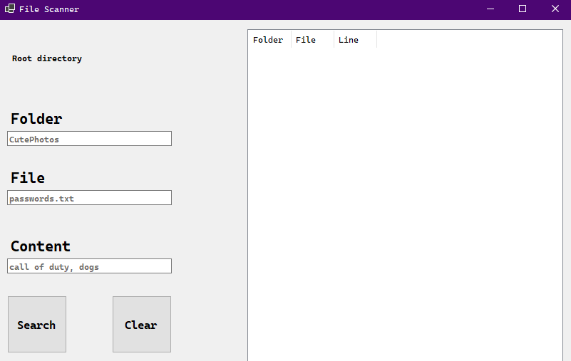
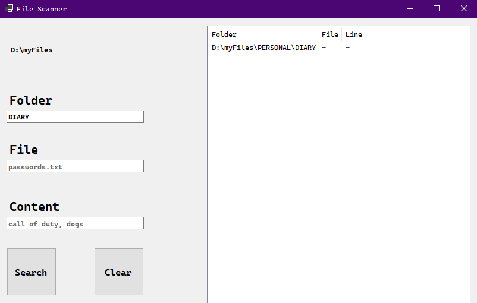
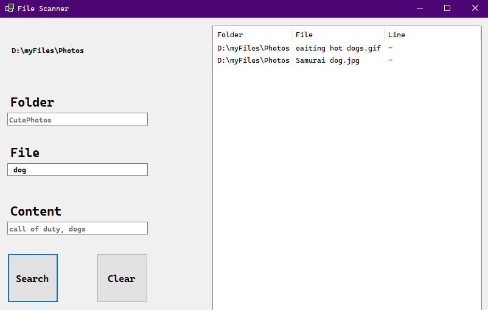
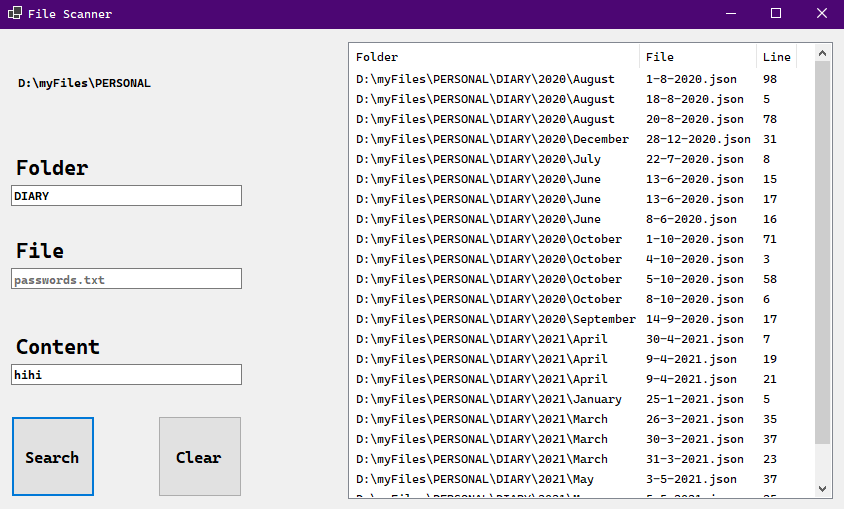
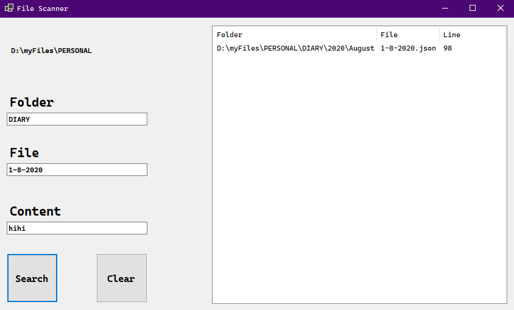

# File-Scanner-WindowsForms

This is a simple app that allows the user to scan their system for specific **folders**/**files** or even **string inputs** in their files.

## How to use

* Compile with Visual Studio
* Select a root directory
* Type anything you wish to find
  * **Folder**,
    * **File** in that **Folder**
    * **Content** (a certain word or phrase)
* Press the "**Search**" button

## Showcase

Find a folder's path

Find files' paths

Find specified content in all files of a folder

Find specified contents of specific file in a certain folder

For multiple contents, separate them with commas (,)

File name does not have to be fully typed with extension. Even a single word is valid input
